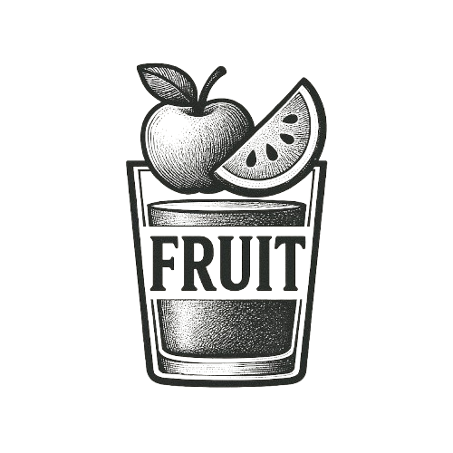
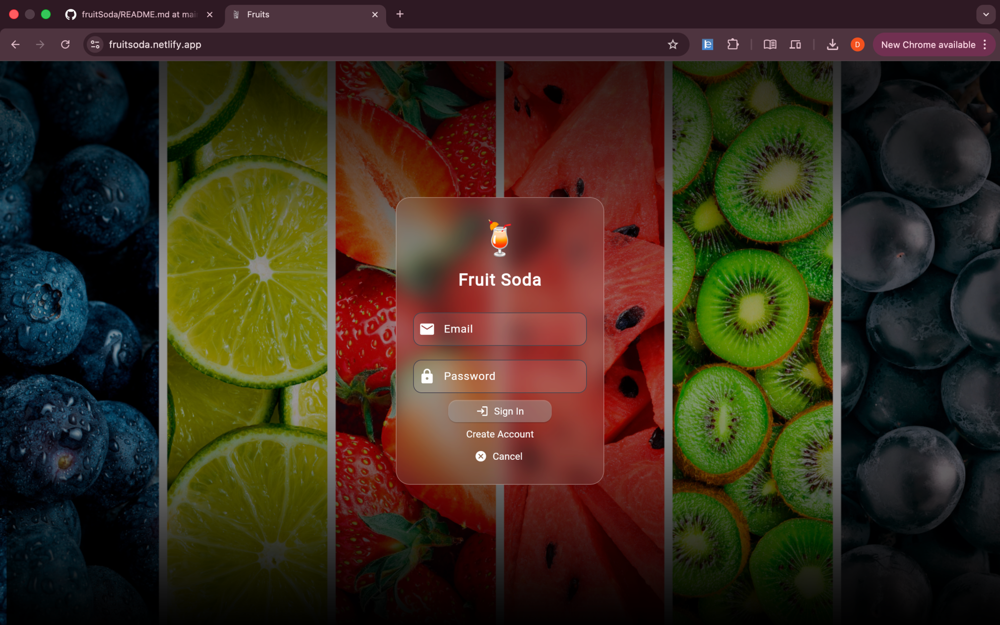

 # FruitSoda 🍎🥤
 <div align="right"> 

  

</div>
**Fresh Juice Delivery App - Order healthy, delicious fruit juices with just a few taps!**

<div align="center">


[](https://flutter.dev)
[](https://dart.dev)
[](https://firebase.google.com)

[Demo](#demo) • [Features](#features) • [Installation](#installation) • [Screenshots](#screenshots) • [Tech Stack](#tech-stack)

</div>

## 📱 About FruitSoda

FruitSoda is a modern Flutter-based mobile application that brings fresh, healthy fruit juices directly to your doorstep. With an intuitive interface and seamless user experience, FruitSoda makes it easy to order your favorite beverages while promoting healthy lifestyle choices.

### 🎯 Key Highlights

- **🚀 Built with Flutter** - Cross-platform compatibility
- **🔥 Firebase Backend** - Real-time data synchronization
- **🍎 Healthy Focus** - Promoting nutritious beverage choices
- **💳 Secure Payments** - Multiple payment options
- **📱 Beautiful UI** - Modern, user-friendly interface

## ✨ Features

### 🛍️ Core Features
- **Product Catalog** - Browse extensive collection of fresh juices
- **Smart Search** - Find your favorite drinks quickly
- **Shopping Cart** - Easy add/remove items with quantity management
- **User Authentication** - Secure login/signup with Firebase
- **Order Tracking** - Real-time order status updates

### 🎨 User Experience
- **Responsive Design** - Optimized for all screen sizes
- **Dark/Light Theme** - Customizable appearance
- **Smooth Animations** - Enhanced user interactions
- **Offline Support** - Basic functionality without internet

### 🔒 Security & Performance
- **Secure Payments** - Encrypted transaction processing
- **Fast Loading** - Optimized images and lazy loading
- **Data Validation** - Robust form validation
- **Error Handling** - Graceful error management

<div align="center">



</div>
## 🛠️ Tech Stack

### **Frontend & Framework**


### **Backend & Database**


### **State Management**


### **Development Tools**


## 📸 Screenshots

<div align="center">

### **App Screenshots**
| | | |
|:-------------------------:|:-------------------------:|:-------------------------:|
| **Splash Screen** | **Login Screen** | **Home Screen** |
|  |  |  |
| **Product Catalog** | **Shopping Cart** | **Order Tracking** |
|  |  |  |

</div>

## 🚀 Installation

### Prerequisites
- Flutter SDK (version 3.16.0 or higher)
- Dart SDK (version 3.2.0 or higher)
- Android Studio/VSCode with Flutter extension
- Firebase project setup

### Step-by-Step Setup

1. **Clone the Repository**
   ```bash
   git clone https://github.com/dronabopche/fruitSoda.git
   cd fruitSoda
   ```

2. **Install Dependencies**
   ```bash
   flutter pub get
   ```

3. **Firebase Setup**
   - Create a new Firebase project
   - Add Android/iOS apps to your Firebase project
   - Download `google-services.json` (Android) or `GoogleService-Info.plist` (iOS)
   - Place them in the appropriate directories

4. **Run the App**
   ```bash
   flutter run
   ```

### Platform Specific Setup

<details>
<summary>📱 Android Setup</summary>

1. Update `android/app/src/main/AndroidManifest.xml` with your Google Maps API key
2. Ensure minimum SDK version is 21 or higher
3. Add internet permissions

</details>

<details>
<summary>🍎 iOS Setup</summary>

1. Update iOS deployment target to 11.0 or higher
2. Configure necessary permissions in `Info.plist`
3. Set up signing & capabilities in Xcode

</details>

## 📁 Project Structure

```
lib/
├── main.dart                 # Application entry point
├── landingPage.dart
├── login.dart
├──  Homepage.dart

```


## 🎯 Future Enhancements

### Planned Features
- [ ] **Loyalty Program** - Rewards and points system
- [ ] **Subscription Model** - Weekly/Monthly juice plans
- [ ] **AI Recommendations** - Personalized drink suggestions
- [ ] **Social Features** - Share orders and reviews
- [ ] **Delivery Tracking** - Real-time GPS tracking

### Technical Improvements
- [ ] **Unit Testing** - Comprehensive test coverage
- [ ] **CI/CD Pipeline** - Automated testing and deployment
- [ ] **Microservices** - Backend architecture upgrade
- [ ] **Web Admin Panel** - Merchant management interface

## 🤝 Contributing

We love contributions! Here's how you can help:

1. **Fork the repository**
2. **Create a feature branch** (`git checkout -b feature/AmazingFeature`)
3. **Commit your changes** (`git commit -m 'Add some AmazingFeature'`)
4. **Push to the branch** (`git push origin feature/AmazingFeature`)
5. **Open a Pull Request**

### Development Guidelines
- Follow [Flutter Style Guide](https://flutter.dev/docs/development/tools/formatting)
- Write meaningful commit messages
- Add tests for new features
- Update documentation accordingly

## 📄 License

This project is licensed under the MIT License - see the [LICENSE](LICENSE) file for details.

## 👨‍💻 Developer

<div align="center">

**Drona Bopche**  
*Flutter Developer | Quantum Computing Enthusiast*

[](https://dronabopche.github.io)
[](www.linkedin.com/in/drona-bopche-2345292b1)
[](https://github.com/dronabopche)

</div>

## 🙏 Acknowledgments

- **Flutter Team** - For the amazing framework
- **Firebase** - For robust backend services
- **Icons8** - For beautiful icons and illustrations
- **Open Source Community** - For continuous inspiration

---

<div align="center">

### **💡 "Stay hydrated, stay healthy with FruitSoda!"**

⭐ **If you like this project, don't forget to give it a star!**


</div>

## 📞 Support

If you have any questions or need help with setup, feel free to:
- 📧 Email: dronabopche@gmail.com
- 💬 Open an [Issue](https://github.com/dronabopche/fruitSoda/issues)
- 🐛 Report a [Bug](https://github.com/dronabopche/fruitSoda/issues/new?template=bug_report.md)
- 💡 Request a [Feature](https://github.com/dronabopche/fruitSoda/issues/new?template=feature_request.md)

---

**Built with 💙 using Flutter & Firebase**
